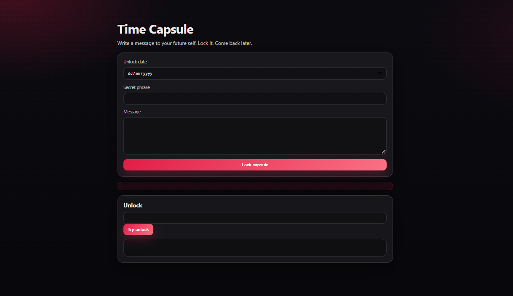

# Storacha Time Capsule ⏳

A simple, static **Time Capsule** website backed by **Storacha**.

Write a message to your future self, lock it with a date and a passphrase, and come back later to unlock it. No backend. No servers. Just a static site published to decentralized storage.




This project is intentionally small and human. It exists to demonstrate how a static website can be built, packaged, and published to Storacha as content-addressed data.

---

## What this project is (and isn’t)

**This project is:**

* A beginner-friendly static web demo
* Built with Vite + TypeScript
* Published as a folder upload to Storacha
* Fully client-side and serverless

**This project is not:**

* A secure encryption system
* A multi-user application
* A backend-powered app
* A production-ready privacy solution

The goal is clarity, not complexity.

---

## Project structure

```
storacha_time_capsule/
├─ ui/                 # Frontend application
│  ├─ src/
│  │  ├─ main.ts       # Time Capsule logic (TypeScript)
│  │  └─ style.css     # Minimal red-themed styling
│  ├─ index.html
│  ├─ package.json
│  └─ dist/            # Build output (generated)
└─ README.md
```

All build and upload commands are run from inside the `ui/` directory.

---

## How the Time Capsule works

* The **website files** (HTML, CSS, JS) are uploaded to Storacha
* The **user’s message and unlock date** are stored locally in the browser using `localStorage`
* When the site reloads, the capsule persists on that device
* The site itself is immutable and content-addressed once uploaded

This separation is intentional:

* Storacha stores and serves the site
* The browser holds private, user-specific state

---

## Prerequisites

Make sure you have:

* Node.js 18 or newer
* npm
* Git
* Storacha CLI installed and logged in

You can verify the CLI with:

```bash
storacha --help
```

---

## Running the project locally

Clone the repo:

```bash
git clone https://github.com/Fatumayattani/storacha_time_capsule.git
cd storacha_time_capsule/ui
```

Install dependencies:

```bash
npm install
```

Start the dev server:

```bash
npm run dev
```

Open the local URL in your browser and try creating a capsule.

---

## Building the static site

From inside the `ui/` directory:

```bash
npm run build
```

This generates a `dist/` folder containing the production-ready static site.

---

## Publishing to Storacha

Upload the built site:

```bash
storacha up dist
```

The CLI will return:

* A root CID
* A gateway URL

You can open your site using a gateway URL like:

```
https://<CID>.ipfs.storacha.link/
```

If the directory doesn’t auto-load, try:

```
https://<CID>.ipfs.storacha.link/index.html
```

That’s it. Your site is live on decentralized storage.

---

## Why this demo exists

This project was built as part of a learning and documentation effort to help developers understand:

* How Storacha works with static assets
* How content-addressed websites differ from traditional hosting
* How simple it can be to publish without servers

If this is your first time using Storacha, this is a good place to start.

---

## License

MIT


